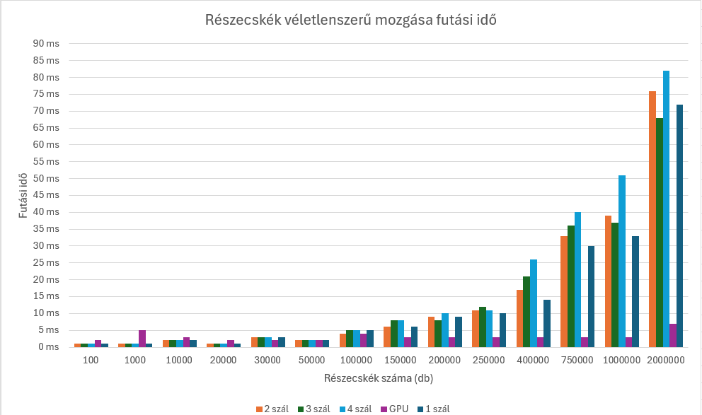

# Párhuzamos eszközök programozása repository

## Féléves beadandó feladat: *Részecske mozgás szimuláció*


## Futtatás
A program futtatásához szükséges az OpenCL SDK. A makefile-ban lévő gcc fordító elérési útvonalát szükséges átírni a saját gcc fordító útvonalára. A *make* parancs kiadásával hozható létre a futtatható állomány. Futtatáshoz használjuk a *.\main.exe <szálak_száma> <részecskék_száma>* parancsot.

## Feladat leírása
A féléves beadandó feladatom témája a részecskék véletlenszerű mozgása köré épül.
A probléma méretét a részecskék száma határozza meg, ez a main.c fájlban van definiálva:

```#define NUM_PARTICLES 1000000```

Ezenkívül meg van határozva a `DT` változó, ami az idő differenciát kívánja szimulálni. Ez a konstans a mozgáshoz szükséges, mivel egy fizikai szimulációról van szó. Ez egy szorzóként szolgál a részecske sebességének kiszámításában.

``` const float DT = 1.2f; ```

A program main függvényében létrehozásra kerül a részecske tömb, ami a részecskék számához viszonyítva foglal le megfelelő helyet a memóriában.

``` Particle *particles = (Particle *)malloc(NUM_PARTICLES * sizeof(Particle)); ```

A véletlenszerű számok tömbjének a deklarálása is itt történik meg, aminek a száma megegyezik a részecskék számának kétszeresével. Ezek a véletlenszerű számok kerülnek felhasználásra a részecske új sebességének kiszámításában. Mivel a részecskék számának kétszerese a tömb mérete, ezáltal a részecske tömb indexének kétszerese adja meg a részecskéhez tartozó véletlenszerű számot.

``` float *randoms = (float *)malloc(2 * NUM_PARTICLES * sizeof(float)); ```

A belépési ponton két függvény hívása történik meg, az egyik a CPU-n hajtja végre a részecske mozgatást, a másik a GPU-n. A CPU hívó függvény egyik paramétere a szálak száma, ennek a számnak a változtatásával növelhető vagy csökkenthető a CPU futási ideje.

## CPU végrehajtás
Legelőször szétosztásra kerül a szálak között a probléma mérete, ezáltal a részecskék bizonyos részének pozícióját és sebességét számítja 1-1 szál. A CPU futási időt a `clock()` függvény valósítja meg, ami az éppen aktuális CPU időt kéri le. A szálak létrehozásánál kéri le a CPU időt, ez lesz a kiindulási idő, majd a szálak befejezésekor kéri le újra a CPU időt, ez lesz a befejezési idő. Ezeket kivonva kapjuk meg a futási időt ms-ben.

## GPU végrehajtás
GPU végrehajtás esetén először inicializálásra kerül a részecske és a véletlenszerű szám buffer, amelyet a kernel fog felhasználni. Ezt követően a kernel-be arugmentumokként vannak megadva a különböző számításhoz szükséges számok. Ezen számok nagy része véletlenszerű. Ezt azért szükséges arugmentumként átadni, mivel az OpenCL-ben nem vagy csak nagyon nehezen lehet véletlenszerű számot generálni. Definiálásra kerül továbbá a GPU magok száma. Ezt követően elindul a GPU-n a számítás, aminek futási idejét profilozással lehet mérni. A profilozás ns-ben méri az időt, amit 10^6-al elosztva kapjuk meg a futási időt ms-ben.


## Futási idők
A program futási ideje a következőképp alakul:


Látható, hogy a GPU-n végrehajtott műveletek közel konstans idővel futnak az összes teszt során, ezzel szemben a CPU-n végzett tesztek futási ideje növekedést mutat.
Kis részecskeszámnál a GPU-n végzett műveletek lassabbak, mint a CPU-n végzettek, például 1000 részecskénél GPU-n 5 ms alatt fut le a művelet, míg CPU-n 1 ms alatt. Az ábrán látszik, hogy 50000 részecskénél egyenlő idő alatt futnak le a műveletek mind a két hardveren, pontosan 2 ms alatt, tehát ez a mintaszám tekinthető a választóvonalnak. Az ettől nagyobb részecskeszámoknál látványosan gyorsabb a GPU végrehajtás, mint a CPU végrehajtás. Például 150000 részecskénél már 6-8 ms között változik a CPU futási ideje, még a GPU futási ideje 3 ms. Ezt követően látszik, hogy a GPU tartja a 3 ms-es futási időt teljesen 2000000 részecskeszámig, ahol a CPU idő is és a GPU idő is duplájára nő. Igaz, ezek a futási idő különbségek nagyon kicsik, de ez a feladat csak egy leegyszerűsített példa volt arra, hogy a GPU mennyivel gyorsabb a CPU-nál párhuzamos számítások és nagy adatmennyiségek esetén.